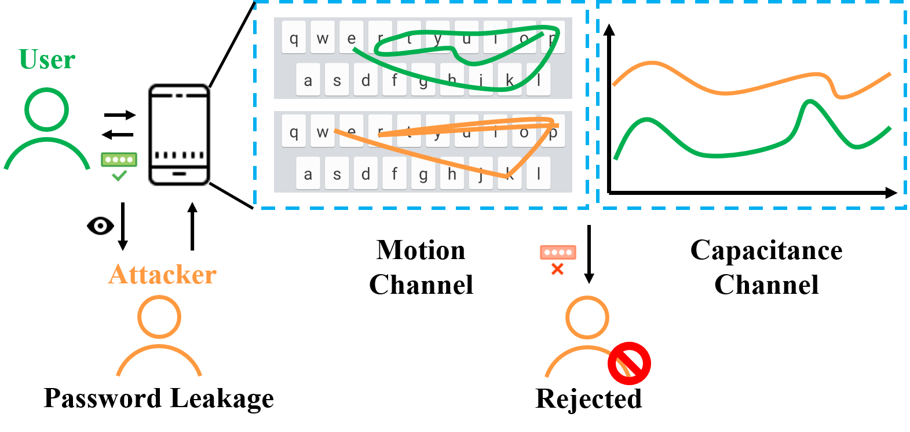
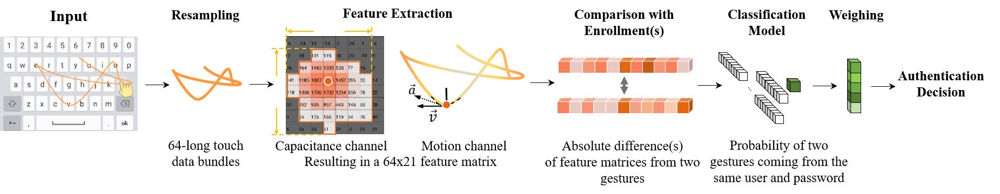
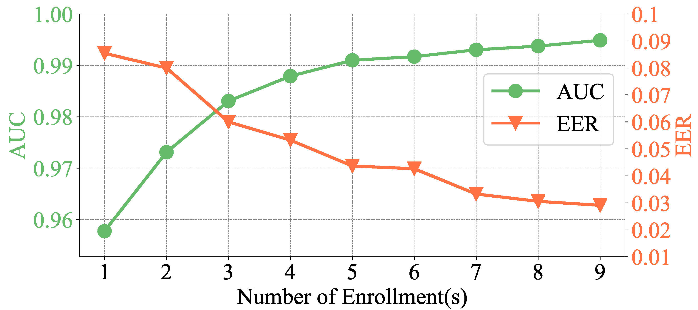

# A Word-Gesture Based Authentication Method on Touchscreen Devices.

## Abstract
Text passwords have suffered from weak security in mobile authentication, especially against leaked password attacks. 
In this paper, we propose LEAVE FOR ANONYMOUS, which entering a text password via a word-gesture - 
to improve the security of text passwords. 
Adopting from the commonly used gesture typing (ShapeWriting) input method, 
WGP can leverage the rich behavioral biometrics in a user's gestures for authentication. 
Our research showed that WGP strongly improves the security of text passwords while maintaining high accuracy. 
In a 54-user, week-long study, even assuming the text password is leaked, using a neural network model for authentication could lead to EER of 8.54% with LEAVE FOR ANONYMOUS. 
Furthermore, we estimated the mutual information in the repeated LEAVE FOR ANONYMOUSs, resulting in high mutual information with a mean (stdv.) of 
174.30 (61.21) bits, which indicates that LEAVE FOR ANONYMOUS is indeed promising for authentication.

## Overview

## Contribution
* First, we showed that LEAVE FOR ANONYMOUS strongly enhanced the security of text passwords by 
leveraging the behavioral biometrics. 
In a 54-user, week-long study, assuming the text passwords are leaked, LEAVE FOR ANONYMOUS can still defend its security, 
having an EER of 8.54%, 6.00% and 2.91% with 1, 3 and 9 enrollment gestures, respectively. 
This promising performance showed that behavioral biometrics can serve as an additional security layer.

* Second, we proposed a set of 9 features that can be extracted from LEAVE FOR ANONYMOUS and 
showed that different users populated distinct 
subspaces of this feature space. 

* Third, we calculated the mutual information contained in the repeated gestures in LEAVE FOR ANONYMOUS, 
which is a recently proposed metric to estimate the strength of gesture-based passwords. 
Our analysis showed high mutual information in LEAVE FOR ANONYMOUS, with a mean (std) value of 174.30 (61.21) bits, 
indicating that LEAVE FOR ANONYMOUS is a promising authentication method.

## Motivation
* A large group of people still use weak text passwords, which include but not limit to passwords containing only vocabularies 
(e.g. lovely, purple),
numbers(e.g. 123456), and easy patterns (e.g. 1q2w3e4r).
* Creating a complicated password (e.g. 3class8 passwords) is both time- and mental-consuming and the outcome password is hard to remember.
* An observation from a not very common habit but insightful (also fun): some users set passwords like "asdfghjkl" to mimic 
the "sliding unlock" on physical keyboard on their PCs or laptops.
* Gesture typing is gradually adopted by users and it shows faster input speed in general cases. Moreover, people behave
variously performing word-gestures.
* An unfortunate thing happened to myself: my bank App was broken which couldn't link my fingerprint reader, 
resulting in that I have to enter my long un-patterned password with symbols manually, EVERY TIME, on my SMALL virtual keyboard
of my phone.

## Examples
